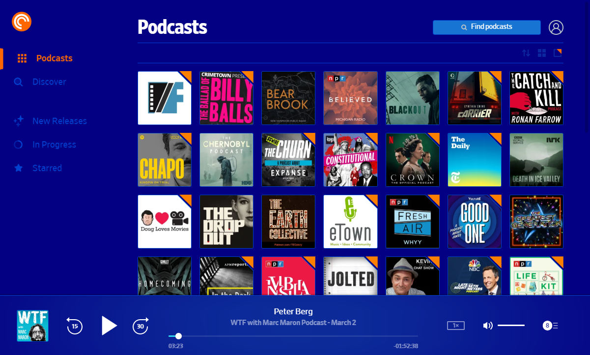

# Pocket Casts Dark Blue
This is a dark blue theme with orange accents for the Pocket Casts web player. It's a work in progress, but most elements should be styled at this point. This style currently only works if the site theme is set to light.

The theme is mostly just color replacements, but I changed a few items to make the theme consistent. Eventually, you'll be able to change the colors in the style settings.

## Installation

To use this style, install the [Stylus](https://add0n.com/stylus.html) extension and then click on the button below.

[![Install directly with Stylus][badge]][style]

[badge]: https://img.shields.io/badge/Install%20directly%20with-Stylus-116b59.svg?longCache=true&style=for-the-badge
[style]: https://github.com/camdecoster/pocket-casts-dark-blue/raw/master/pocket-casts-dark-blue.user.css

**NOTE:** _Stylish_ is the old, obsolete extension that Stylus is based off of. It was fine until it started doing shady things with user data. Don't use _Stylish_, use [Stylus](https://add0n.com/stylus.html).